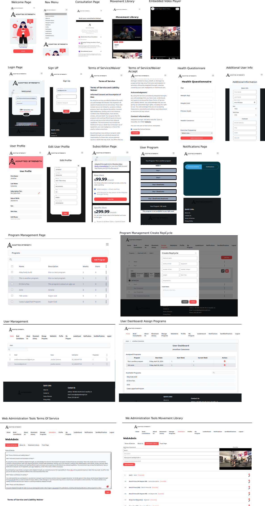

<div align="center">  
<h1>
    Adapted Strength Web App
</h1>
</div>

## Project Description
**Adapted Strength** is a mobile-first application for a strength and conditioning gym lead by **Alex Palting** in Vacaville, CA. The goal of this project is to create a seamless digital hub for Adapted Strength clients, enhancing their training experience and eliminating the need for external applications.

The project aims to take existing processes necessary to run the business that require third-party tools and consolidate them into a single and easy-to-use application.

#### Page Layout


#### Backend Architecture Diagram


#### ERD


## Features
* Modern Mobile Friendly UI
* Chat Capabilities
    * Video
    * Text
* Content Management
      * User Excercise Plans
      * Movement Video Library
* Notification
    * Push
    * Announcements
* Subscription Management
* User Authentication/Authorization
* User Profile Management

## Setup Instructions
> 🚧 PREREQUISITES 🚧 You need NodeJS>18 and Java>=17.

### Environment Setup
You need the following Environment variables set.
```sh 
export ADAPTED_STRENGTH_WEB_URL="localhost"
export ADAPTED_STRENGTH_WEB_PORT="3000"
export ADAPTED_STRENGTH_WEB_PROTOCOL="http"
export ADAPTED_STRENGTH_EMAIL="<email here>"
export ADAPTED_STRENGTH_PASSWORD="<password here>"

export AWS_SECRET_KEY=
export AWS_ACCESS_KEY=
export AWS_REGION="us-west-2"

export ADAPTED_STRENGTH_STRIPE_SECRET_KEY=<strike secret key here>
export ADAPTED_STRENGTH_BASE_PRICE_ID=<product price here>
export ADAPTED_STRENGTH_GENERAL_PRICE_ID=<product price here>
export ADAPTED_STRENGTH_SPECIFIC_PRICE_ID=<product price here>
export ADAPTED_STRENGTH_STRIPE_ENDPOINT_SECRET=<stripe endpoint secret here>
```
> 🚧 NOTE 🚧 The `ADAPTED_STRENGTH_EMAIL` and `ADAPTED_STRENGTH_PASSWORD` are used for sending emails. 
> Replace everything in the <> with the actual values.

1. Clone the repository using:
   ```sh
    git clone https://github.com/kyperbelt/adapted-strength.git && cd adapted-strength
   ```
2. Move into the authorization folder
   ```sh
   cd authorization
   ```
    And then Run `./gradlew bootRun`
4. Move into the frontend folder
   ```sh
   cd ../frontend/adapted_strength-app
   ```
    And then Run `npm install && npm start`

### Testing 
#### Backend
1. Move into the authorization folder
   ```sh
   cd authorization
   ```
    And then Run `./gradlew test`

#### Frontend
1. Move into the frontend folder
   ```sh
   cd ../frontend/adapted_strength-app
   ```
    And then Run `npm test`
    > 🚧 NOTE 🚧 There is currently not many unit tests for the frontend. 
2. To run manual functinal tests, first setup the backend by 
    1. On a separate terminal, move into the authorization folder
        ```sh
        cd authorization
        ```
        And then Run `./gradlew bootRun`
    2. Move into the frontend folder in your original terminal and run `npm install && npm start`


## Onboarding Resources

* [Getting Started Using Git & Github](docs/using_git.md) 

## Team

### Team Leader 
- Jonathan Camarena Camacho
    - Discord: `kyperbelt`
### Database developers
- Danny Zhou
    - Discord: `ztimid`
- David Castrejon
    - Discord: `bartholamewthethird`
### Backend developers
- Jeff Huang
    - Discord: `mrb1ue`
- Blake Danz
    - Discord: `buh_la_key`
- Amir Talakoob
    - Discord: `darkscorpion13`
- Joshua Cupler
    - Discord: `johncup`
### Frontend developers
- Casey Paras
    - Discord: `lumikha`
- Ahmed Taeha
    - Discord: `ataeha`

### Product Owner
- Alex-Andre B. Palting
