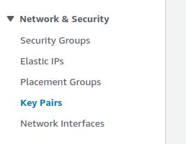
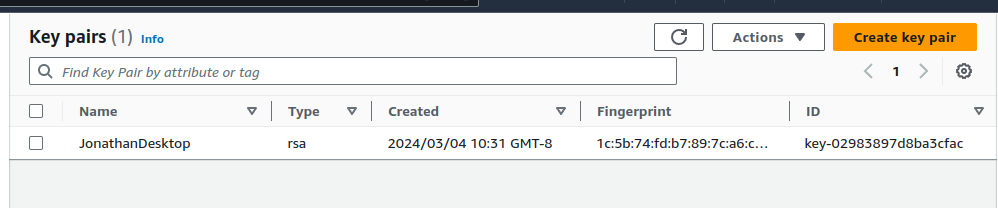

# Backend

## Introduction 

The backend will be hosted on an EC2 instance.

## Setup SSH key
1. From the ec2 dashboard side panel under the **Network and Seciruty** section select the Key Pairs.  


2. Import your public key from you pc, using the **Actions** dropdown. 



## Connect to your server using SSH

1. Get the ip of your ec2 instance and then do the following 
```sh 
ssh ec2-user@<ip-here>
```

**Thats it!** 

