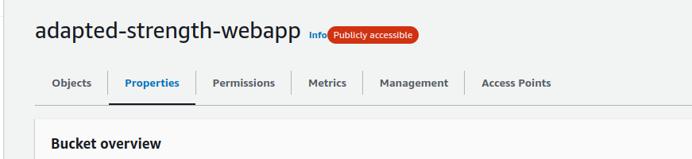

# Frontend 

## Introduction
Our frontend will be hosted on an **AWS** s3 bucket using the s3 static hosting option. This will allow us to easily deploy and update our application.  

## S3 Static Hosting 
Before we deploy out website we have to setup and configure an **AWS S3** bucket that will hold our website files.

### Create A Bucket
Create an s3 bucket from the console by hitting the S3 link, and then hitting the create s3 bucket button.
<div class="warning">
<b>IMPORTANT:</b> make sure that the bucket is publicly accessbile during creation. 
</div>

1. <br/>
2. <br/>


### Configuration 

#### Setup Hosting
First we need to configure our site for static webhosting. We do this by navigating into our bucket, and then selecting the **Properties** tab. 



Then we scroll all the way down to the **Static Website Hosting** section and clicking on *Edit* .


After that we enable it, select **Static Website** and then set both the *<index document>* and *<error ducment>* to `index.html`. This is because react router will handle our errors for us.    


#### Setup up Access
Go into the permissions tab now and in the **Bucket Policy** sections set the following: 
```json
{
    "Version": "2012-10-17",
    "Statement": [
        {
            "Sid": "Statement1",
            "Effect": "Allow",
            "Principal": "*",
            "Action": "s3:GetObject",
            "Resource": "arn:aws:s3:::adapted-strength-webapp/*"
        }
    ]
}
```


## Steps to Deploy

1. First build the frontend using the following command. 
    ```sh 
    npm run build
    ```
    > This will build out frontend and put it inside the `build` directory.

2. Next we want to upload all those files into our aws s3 bucket, it should look like this once its all uploaded:


3. Done! easy as that.
