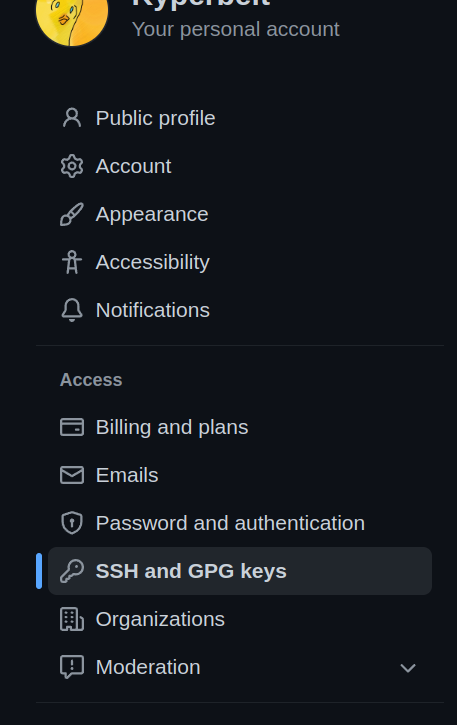
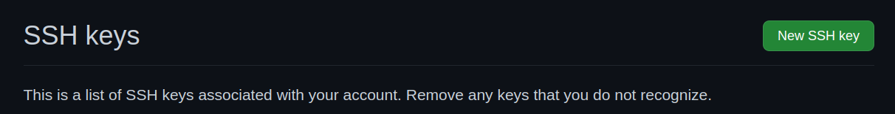
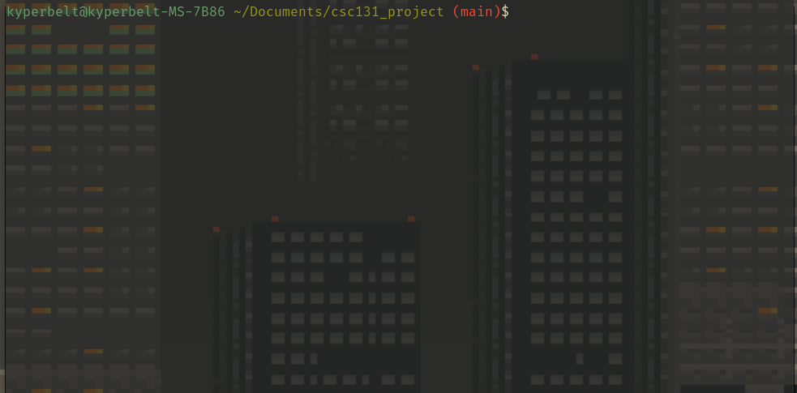

# Getting Started with Git and Github

## Table of Contents
  - [Introduction](#introduction)
    - [Differences between Git and Github](#differences-between-git-and-github)
  - [Downloading and Installing Git](#downloading-and-installing-git)
    - [Windows](#windows)
    - [MacOS](#macos)
    - [Linux (Ubuntu)](#linux-ubuntu)
  - [Setting up Github with SSH](#setting-up-github-with-ssh)
    - [Generating an SSH Key-Pair](#generating-an-ssh-key-pair)
    - [Adding your PUB Key to Github](#adding-your-pub-key-to-github)
  - [Configuring Git](#configuring-git)
    - [Open Bash CLI (Windows OS)](#open-bash-cli-windows-os)
    - [Basic CLI Navigation](#basic-cli-navigation)
      - [List Command](#list-command)
      - [Change Directory](#change-directory)
      - [Exmaple](#exmaple)
    - [Set MergeTool (Recommended)](#set-mergetool-recommended)
  - [Cloning the Repository](#cloning-the-repository)
  - [Troubleshooting](#troubleshooting)
## Introduction

This guide will focus on getting you set up with the git cli so that by the end you will have a cloned this github repository locally on your computer.

### Differences between Git and Github
Although it might be easy to confuse the two. **Git** is the tool that is doing all the work for tracking and storing different versions of our codebase. **Github** is just the service we use to store our git controled codebase so that everyone on the team can also have access to it.

[Here is quick Git Crash Course (Recommended Watch)](https://www.youtube.com/watch?v=USjZcfj8yxE)

---
## Downloading and Installing Git
Before we can start working with our codebase on **Github** we must first download a git version control tool. For this project and this walkthrough I will only mention the vanilla command-line [**Git**](https://git-scm.com/) tool, but there are other options like [Github Desktop](https://desktop.github.com/) or [SourceTree](https://www.sourcetreeapp.com/) which provide a graphical user interface for working with git controled projects.


### Windows
You can download the standalone [ installer here. ](https://git-scm.com/download/win)
> :warning: Unless you have a really old machine I recommend downloading the 64bit installer.

You can use the recommended settings in the installer. If it asks you to set the `PATH` variable say yes.

Once your installation is complete you should be able to open up an application called `Git Bash` which is what we will be using to manipulate our git repo.

### MacOS
Most version of mac should have a version of git already installed. To check simply open up a terminal and run the following command: 

```sh 
git --version
```

if you get a number like `2.XX.XX` as output then you are good to go :thumbsup:. 

If you got a command not found then you will need to install it. You can [download the installer](https://sourceforge.net/projects/git-osx-installer/) or install through homebrew using the following command in your terminal: 
```sh
brew install git
```
[ Here is a link to the git Downloads page for more installation options. ](https://git-scm.com/download/mac)

### Linux (Ubuntu)
This is by far the simplest way of installing. Simply run the following commands
```sh
sudo apt update
sudo apt install git
```

To confirm that everything is working correctly open up a terminal and type `git --version` and you should get a version number as output. 

If you get something like "'git' command not found." then something did not install properly or you might need to restart your terminal for it to take effect. 


---
## Setting up Github with SSH
There is a way to work with github using a credential manager instead of ssh but ssh is what I use so it is what I will show you. If you are interested in other methods please checkout this resource: [Authenticating with Github frm Git (Optional)](https://docs.github.com/en/get-started/quickstart/set-up-git#authenticating-with-github-from-git)
> :warning: You will not be able to work on the project without proper authentication since it is private.


### Generating an SSH Key-Pair

- Open a new Terminal window (Git Bash on Windows)
- Type `ssh-keygen -b 4096 -t rsa` 
- You will be prompted to enter a filename. By default, your keys will be saved as id_rsa and id_rsa.pub. Simply press Enter to confirm the default - there is no need to change this unless you have multiple keys! (Note: if you would like to change the default filename, you'll need to include the complete file path)
- When prompted, enter a passphrase.
> :information_source: be sure to make this an easy password since you might have to type it in often.
- This will created a hidden directory called .ssh that contains both your public (id_rsa.pub) and private (id_rsa.) key files. 
[Source with more in depth steps](https://mdl.library.utoronto.ca/technology/tutorials/generating-ssh-key-pairs-mac)


> :warning: On windows pay close attention to the location of your `.ssh` folder. You will need it for the next step.


### Adding your PUB Key to Github

1. Locate the `id_rsa.pub` file from the previous step, open it in a text editor and copy all of its content.
2. Go to github account settings on from the top-right menu, and then select `SSH and GPG Keys` option from the menu on the left.

|                    Account Settings                     |                     SSH & GPG Keys                      |
| :-----------------------------------------------------: | :-----------------------------------------------------: |
|  |  |

3. Click on the `new SSH key` button. 

4. on the next page you will be given the option to set the title(name you want to save the key under ex. `MyPC`) and in the big box labeled `Key` you will enter all the contents from your `id_rsa.pub`. 
5. Click on the green `Add SSH key` button and you are all set!


[What is SSH?](https://en.wikipedia.org/wiki/Secure_Shell)

---
## Configuring Git
We are going to configure our git command line tool now.
> :warning: The following assumes you are using GitBash if you are on windows.

### Open Bash CLI (Windows OS)
On windows you can open the git Bash Terminal which will allow you to use unix commands to navigate your folder structures. I highly recommend using this over the default windows cmd or Terminal app so that you can follow along with the rest of the guide. 

### Basic CLI Navigation
The following is just a quick list of navigation commands that will make using the `Git Bash` or `Terminal` a lot easier. 


#### List Command
The `List` command allows you to see all the files and folders in the current directory.
To use it you use the following command: 
```sh
ls
```
To list everything including hidden `.`(dot) directories you can use the following: 
```sh
ls -a
```

#### Change Directory
The `Change Directory` command lets us change the current working directory(in the terminal). 
You can use the following command:
```sh
cd <folder_path>
```
replace `<folder_path>` with the path to the folder relative to the current working directory. For example, if my current working directory is the `documentation` folder and I want to move into the `git` folder I have to type the following command: 
```sh
cd git
```

#### Exmaple
> :warning: Your command line and pathing might look different. 



### Set MergeTool (Recommended)
Sometimes we will get conflicts that we must resolve before we are able to merge our code with the rest of the codebase. For this we will use our mergetool. 

> :warning: If you do not set a merge tool you will be stuck using the default git merge tool which is not very user friendly. 

I suggest using an editor you are confortable with such as `vscode` as your merge tool.

For more information on setting your mergetool to vscode [ see here ](https://www.roboleary.net/vscode/2020/09/15/vscode-git.html).

--- 
## Cloning the Repository
1. From your terminal(Git Bash on Windows) - Navigate to the folder where you will copy a local version of the repository. For me, this is my `Documents` folder.
2. Once you are there, We will copy the github repository for this project using the following command: 
```sh
git clone git@github.com:kyperbelt/adapted-strength.git
```
> :warning: You might have to put type in your SSH password

3. Navigate to that folder by first using the following command: 
  ```sh
cd adapted-strength
  ```
4. You can use the `git status` command to check the current status of your working branch. 
<!-- 5. We will not be working directly on the `main` branch so the next step is to create a new branch just for you using the following command:  -->
<!-- ```sh -->
<!-- git checkout -b YourName-development -->
<!-- ``` -->
<!-- so for me it would be:  -->
<!-- ```sh -->
<!-- git checkout -b jonathan-development -->
<!-- ``` -->
<!-- 6. Example:  -->
<!--     -->
<!---->
<!-- 7. You can push this branch to **Github** using the following:  -->
<!--   ```sh -->
<!--   git push -u origin YourName-development -->
<!--   ``` -->
<!--   > :warning: Be sure to replace `YourName` with your name. -->
<!---->
<!-- > :information_source: [Useful Git Cheat Sheet](https://education.github.com/git-cheat-sheet-education.pdf) -->
<!---->
<!-- You should now be working on your own branch and are now ready to move on to [ Making your First Change ](first_change.md). -->
<!---->
--- 
## Troubleshooting

[Home](../README.md)
